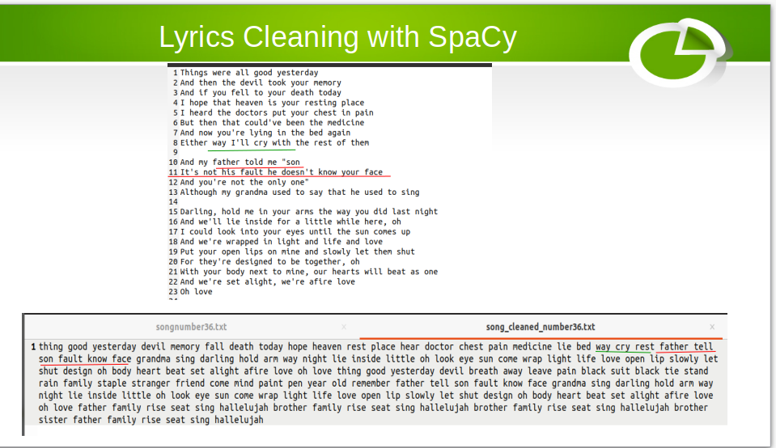
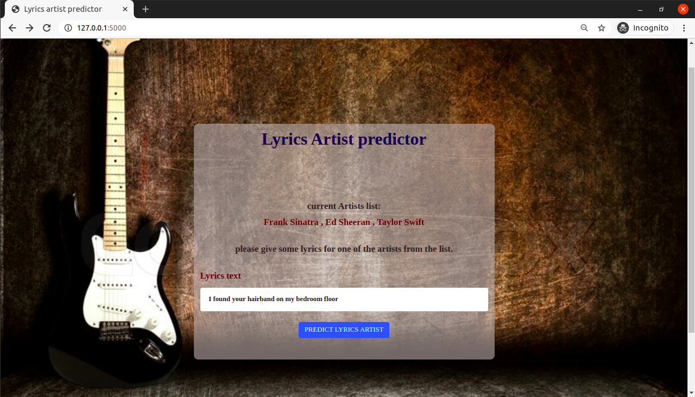

# lyrics-artist-predictor

A web-based lyrics artist predictor, predicts the artist who sings the lyrics which the user had typed.

Three artists where chosen: Frank Sinatra , Ed Sheeran , Taylor Swift , but you can also choose your favourite artists.

to train the model we collect songs for each artist from Genius.com with LyricsGenius API.

to clean the songs lyrics, we used two options:
- clean with Natural-Language tool-kit(NLTK).
- clean with spaCy.

spaCy provides the best way to do it.It provides the fastest and most accurate syntactic analysis of any NLP library released to date.

Then the model was trained to predict the artist based on two models: Random Forest classifier, and Multinomial Naive baise, with a Grid Search to find the optimal parameters.

### Clean text with cpaCy:
we used spaCy which is an open-source software library for advanced natural language processing to clean the songs lyrics through:
- Lemmatization.
- remove noise (stopwords, digit, puntuaction and single characters).
- remove empty tokens and one letter tokens.
- remove non alphabetic characters.
- remove non-Unicode characters.

### Usage:
- clone the repo.
- install the requirements.
- you can use the terminal for prediction by running main.py with some lyrics:

  python main.py 'lyrics goes here'
- or you can use the web interface by running: python application.py then go to your browser and type: localhost/5000

- to build and train a model with different artists, you can change the following in lyrics_classify_model.py:

    artists = ['Frank Sinatra','Ed Sheeran','Taylor Swift']
    
    max_songs=150   #You can change the max number of songs for an artist
    
    and untag these two lines:
    
    #collect_songs(artists,max_songs)

    #spacy_cleaner(artists,max_songs)
    
## License

- **[MIT license](http://opensource.org/licenses/mit-license.php)**

